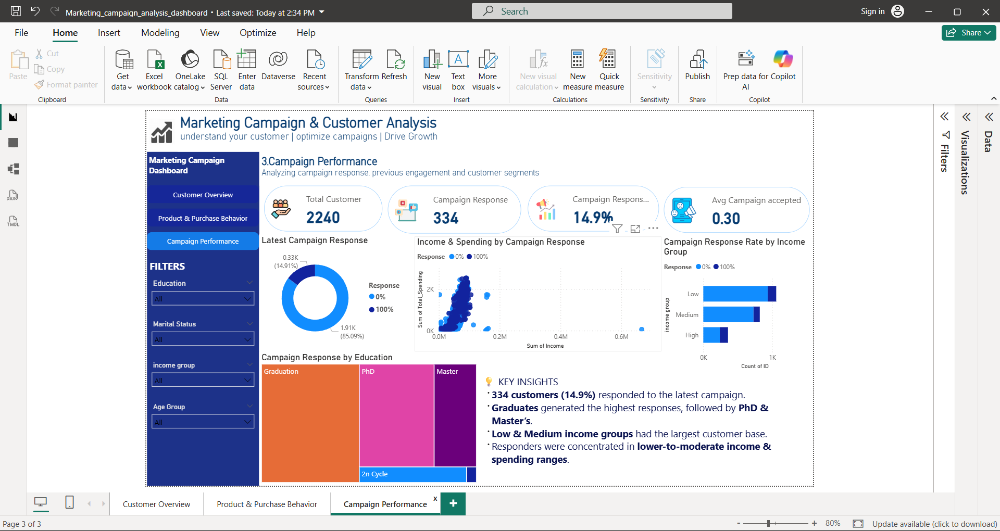

# Marketing Campaign & Customer Analysis

## 📌 Project Overview

This project analyzes customer demographics, purchasing behavior, product spending, and marketing campaign responses to identify customer segments and understand campaign engagement patterns.

The analysis was performed using **Excel and Power BI** on a dataset containing **2,240 customer records**.

---

## 🎯 Business Objective

The objective was to:

- Understand customer demographics and purchasing behavior
- Identify high-spending customer segments
- Analyze product spending and purchase channels
- Evaluate marketing campaign responses
- Compare previous campaign engagement with the latest campaign response

---

## 🛠️ Tools & Technologies

- **Microsoft Excel** – Data cleaning, transformation, PivotTables and analysis
- **Power BI** – Dashboard development, KPIs, slicers and visual analysis

---

## 🔍 Analysis Performed

### Customer Analysis
- Customer distribution by education and marital status
- Customer segmentation by age and income
- Income and spending comparison
- Customer purchasing patterns

### Product & Purchase Analysis
- Spending across 6 product categories
- Purchase behavior across Web, Catalog and Store channels
- Spending and purchasing patterns across customer segments

### Campaign Analysis
- Latest campaign response rate
- Previous campaign acceptance across 5 campaigns
- Campaign response across education and income groups
- Comparison of campaign response with customer spending and purchasing behavior

---

## 📊 Power BI Dashboard

### 1. Customer Overview

Provides an overview of customer demographics, income and spending patterns.

### 2. Product & Purchase Behavior

Analyzes product spending and purchasing behavior across different channels and customer segments.

### 3. Campaign Performance

Analyzes campaign responses, previous campaign engagement and customer segment patterns.

---

## 📈 Key Findings

- **2,240 customers** were analyzed across demographics, spending and purchasing behavior.
- **334 customers (14.9%)** responded to the latest marketing campaign.
- **Wine products** accounted for the highest product spending.
- **Store purchases** represented the largest major purchase channel.
- Campaign responses were compared across **education, income, spending and previous campaign engagement**.

---

## 📂 Project Files

- 📊 **Dashboard** – Power BI dashboard screenshots
- 📁 **Data** – Excel dataset and analysis workbook

---

## 💡 Conclusion

The analysis provides a consolidated view of customer behavior and marketing campaign engagement, helping identify customer segments and patterns that can support targeted marketing analysis.
